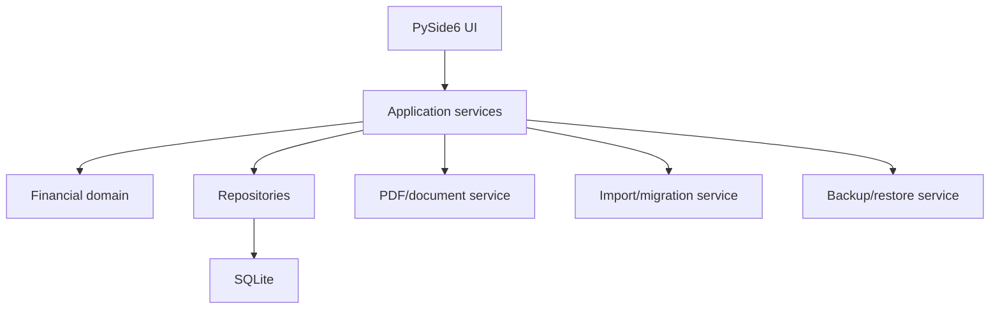

# Invoice & Receipt Manager

## Complete AI Build Specification, Program Design, Migration Contract, and Test Plan

**Instruction to implementing AI:** Treat this document as the authoritative build specification. Implement the complete working Windows desktop application, its automated tests, migration/import workflow, PDF templates, backup/restore functions, installer configuration, and user documentation. Do not add student, course, enrolment, certificate, or certificate-credit management. Do not stop after scaffolding or a prototype. Continue until all release acceptance criteria in this document pass.

**Owner and primary user:** Alexander Gillam  
**Target environment:** One-person Windows desktop system  
**Initial release:** 1.0  
**Locale:** Australia  
**Date format:** DD/MM/YYYY  
**Currency:** AUD  
**Financial year:** 1 July–30 June  
**Prepared:** 28 July 2026

---

# Part A - Mission and Boundaries

## 1. Product mission

Build a simple, reliable local application that allows the owner to:

1. create professional invoices;
2. track what has been billed, paid, unpaid, and overdue;
3. record partial or multiple payments;
4. generate a receipt from each saved payment;
5. manage clients and reusable services;
6. record non-invoice income and business expenses;
7. link supporting documents;
8. produce useful financial, GST, ATO-oriented, and ageing reports;
9. import and preserve the existing financial data and PDFs;
10. back up and restore the entire system safely.

This is a single-user personal business system. It does not need global scale, a cloud database, enterprise permissions, complex role-based access, or simultaneous multi-user editing.

## 2. Why this is a clean rebuild

The previous application combined:

- invoices;
- clients;
- ledger;
- students;
- courses;
- enrolments;
- certificate budgets;
- certificate generation;
- reports.

Some feature ideas were useful, but the modules were too tightly coupled. The system developed invalid/duplicate-looking records, inconsistent dates and statuses, disconnected receipt generation, and financial logic that did not integrate reliably.

The replacement must preserve useful ideas without preserving the old architecture.

## 3. Strict exclusions

Do not implement:

- student records;
- student profiles;
- USIs;
- courses or trainers;
- enrolments;
- attendance;
- course completion;
- certificate creation;
- completion sign-offs;
- certificate credits;
- top-ups;
- allocation/reallocation pools;
- course booking reports;
- a “From Course” invoice function;
- student/course imports;
- any database table whose purpose is student or training management.

The words “certificate ordered” or “certificate delivered” may appear only as ordinary invoice service descriptions.

## 4. Future boundary

A separate student/completion system may later create an invoice request containing client, description, quantity, price, external reference, and document link. It must not write directly to this database.

---

# Part B - Required Deliverables

The implementing AI must produce:

1. complete Python source code;
2. SQLite schema and versioned migrations;
3. PySide6 Windows interface;
4. invoice, receipt, credit-note, and report PDF generators;
5. importer for the supplied migration bundle;
6. legacy-folder/ZIP migration assistant;
7. automated unit, domain, integration, GUI, migration, PDF, backup, and regression tests;
8. Windows PyInstaller build configuration;
9. Inno Setup installer configuration;
10. sample configuration and first-run setup;
11. user guide;
12. migration report template;
13. release/test summary;
14. diagnostic logging and bundle generator;
15. backup and restore implementation.

Do not return placeholder functions, fake buttons, unimplemented menus, or tests that merely assert `True`.

---

# Part C - Recommended Technical Architecture

## 5. Technology

| Area | Required/recommended choice |
|---|---|
| Language | Python 3.12+ |
| GUI | PySide6 |
| Database | SQLite |
| ORM/data access | SQLAlchemy 2.x plus Alembic, or an equivalently clean repository layer |
| PDF | ReportLab |
| PDF validation | pypdf/pdfplumber and Poppler rendering |
| CSV/Excel | Python CSV and openpyxl |
| Password hashing | Argon2id |
| Tests | pytest, pytest-qt, Hypothesis where useful |
| Packaging | PyInstaller |
| Installer | Inno Setup |

SQLite is internal. The user does not need to write SQL or run a database server.

## 6. Architecture rule

Use layers:



Do not put calculation, migration, numbering, status, or reconciliation logic inside GUI button handlers.

## 7. Proposed project layout

```text
invoice_receipt_manager/
  pyproject.toml
  README.md
  src/invoice_manager/
    __main__.py
    app.py
    config.py
    domain/
      money.py
      invoices.py
      payments.py
      credits.py
      statuses.py
      validation.py
    application/
      invoice_service.py
      payment_service.py
      receipt_service.py
      credit_service.py
      client_service.py
      ledger_service.py
      reporting_service.py
      migration_service.py
      backup_service.py
    persistence/
      models.py
      repositories.py
      database.py
      migrations/
    documents/
      invoice_pdf.py
      receipt_pdf.py
      credit_pdf.py
      report_pdf.py
    ui/
      main_window.py
      login.py
      dashboard.py
      invoice_editor.py
      invoice_list.py
      payment_receipt_view.py
      clients.py
      services.py
      ledger.py
      reports.py
      settings.py
      migration_wizard.py
      backup_restore.py
      common/
    infrastructure/
      audit.py
      logging_setup.py
      file_store.py
      instance_lock.py
  tests/
    unit/
    domain/
    integration/
    migration/
    pdf/
    gui/
    e2e/
    fixtures/
  installer/
  scripts/
```

## 8. Storage layout

```text
InvoiceReceiptManager/
  data/business.sqlite3
  documents/invoices/YYYY/
  documents/receipts/YYYY/
  documents/credit-notes/YYYY/
  documents/attachments/
  exports/
  backups/
  logs/
```

Keep program files separate from user data.

## 9. OneDrive policy

Preferred:

- live database on local disk;
- backup ZIPs in OneDrive;
- exports optionally in OneDrive.

If the live database is placed in OneDrive:

- display a warning;
- use a single-instance lock;
- do not support the application being open on two computers;
- never claim that OneDrive makes SQLite a multi-user database.

---

# Part D - User Experience Design

## 10. Navigation

Use a left navigation rail:

1. Dashboard
2. New Invoice
3. Invoices
4. Payments & Receipts
5. Clients
6. Products & Services
7. Income & Expenses
8. Reports

Application menu:

- Settings
- Import/Migrate
- Export
- Backup Now
- Restore
- Users
- Audit Log
- App Log
- Help
- About

## 11. Preserve these good old-system ideas

- automatic invoice number and due date;
- client selection with Manage Clients;
- reusable service catalogue;
- editable line-item table;
- live subtotal/GST/total;
- invoice history with status colours;
- Open PDF;
- Record Payment;
- Cancel/Void;
- Reissue Invoice;
- Link PDF;
- Reveal Folder;
- Record Missing Invoice;
- Copy and CSV export;
- client invoice count and total billed;
- business, payment, invoice, PDF, reports, backup, startup, and data settings;
- visible current user and data location;
- audit/app logs;
- automatic backup.

## 12. Do not reproduce these old-system problems

- no Students/Courses/Cert Budget tabs;
- no “From Course” button;
- no huge sparse form stretched across the screen;
- no action column containing many permanently enabled buttons;
- no silent `ERROR` client;
- no unexplained `0001-1` invoice;
- no $0 invoice marked Paid without review;
- no editable issued financial values;
- no manually toggled Paid status;
- no disconnected receipt generator;
- no raw CSV files pretending to be a relational database;
- no silent failures;
- no invalid blank values displayed as `0`.

## 13. Screen behaviour

### Dashboard

Cards:

- invoiced this financial year;
- cash received this financial year;
- unpaid balance;
- overdue balance;
- expenses;
- net cash;
- GST collected/paid where applicable;
- draft/issued/overdue counts.

Lists:

- recent invoices;
- recent payments;
- invoices due soon;
- migration/data issues requiring attention.

Cards and rows open filtered detail screens.

### New Invoice

Use a compact two-column header, full-width line-item area, and fixed summary/action footer.

Header:

- Draft indicator or invoice number after issue;
- invoice date;
- due date;
- client;
- reference/purchase order;
- client billing snapshot;
- visible notes;
- internal notes.

Items:

- service;
- description;
- quantity;
- unit;
- unit price;
- discount;
- taxable;
- subtotal;
- GST;
- total.

Actions:

- Save Draft;
- Preview;
- Issue Invoice;
- Clear/Discard.

### Invoice list

Top search/filter bar, sortable table, right-side detail drawer.

Columns:

- invoice number;
- date;
- due date;
- client;
- total;
- paid;
- balance;
- status;
- document indicator.

Context actions:

- View;
- Open PDF;
- Record Payment;
- View Payments/Receipts;
- Duplicate;
- Reissue PDF;
- Link/Relink PDF;
- Reveal Folder;
- Cancel/Void;
- Create Credit;
- Register Missing Invoice;
- Export.

Enable only actions valid for the selected record.

### Clients

Columns:

- client;
- contact;
- phone;
- email;
- invoices;
- total invoiced;
- total paid;
- balance;
- overdue.

Do not create active clients from invalid legacy values without review.

### Settings

Sections:

- Business;
- Banking/Payment;
- Numbering;
- GST/Currency;
- Documents;
- Data/Backup;
- Users;
- Startup/Support.

Cancel must discard unsaved changes. Save must validate.

## 14. Usability requirements

- keyboard-accessible core workflows;
- obvious tab order;
- visible focus;
- status uses text as well as colour;
- no horizontal scrolling at 1920×1080;
- supports 125% Windows scaling;
- searchable tables;
- sortable columns;
- consistent right-click copy row/cell/all;
- `Ctrl+C`, `Ctrl+A`, and export;
- plain-language validation near the field;
- mandatory reason for destructive financial corrections;
- Australian date picker plus tolerant typed-date parser.

---

# Part E - Financial Domain and Business Rules

## 15. Money

- Store all currency as integer cents.
- Never store money as binary floating point.
- Use Decimal during calculations/import conversion.
- Use one documented cent-rounding rule consistently.
- Recalculate totals rather than trusting imported calculated columns.

## 16. Invoice lifecycle

| Status | Rule |
|---|---|
| Draft | Not issued |
| Issued | Issued, balance > 0, not overdue, no valid payments/credits |
| Part Paid | Payment/credit > 0 and balance > 0 |
| Paid | Balance = 0 through payments |
| Overdue | Balance > 0 and due date is before today |
| Credited | Balance = 0 through credits |
| Cancelled | Cancelled before recognition as valid sale |
| Void | Number retained but document invalid |

Paid, Part Paid, and Overdue are calculated. The user must not simply tick “Paid”.

## 17. Numbering

- Canonical display: `INV-0001`, `RCT-0001`, `CN-0001`.
- Import recognises `0001`, `INV001`, `INV-0001`, and other explicitly approved safe variants.
- Do not silently merge `0001-1`.
- Recommended: permanent invoice number assigned only at issue.
- Drafts use internal IDs and display `DRAFT`.
- Reserve numbers transactionally.
- Never automatically reuse a used/cancelled/void number.
- After initial migration, next invoice is at least `INV-0005`.

## 18. Invoice calculations

For each item:

```text
gross = quantity × unit_price
discount_amount = fixed or calculated percentage discount
taxable_base = gross - discount_amount
gst = round(taxable_base × stored_gst_rate) if taxable
line_total = taxable_base + gst
```

For invoice:

```text
subtotal = sum(taxable_base)
gst = sum(line_gst)
invoice_total = sum(line_total)
valid_payments = sum(non-reversed payments)
valid_credits = sum(non-void credits)
balance = invoice_total - valid_payments - valid_credits
```

## 19. Issued snapshot

At issue, store:

- business name, ABN, address, phone, email;
- bank/payment instructions;
- GST registration and rate;
- client name, ABN, contact, email, phone, address;
- line descriptions, quantity, unit, price, discount, GST flag/rate;
- notes/footer;
- invoice/due dates;
- calculated totals.

Later edits to settings, client, or catalogue do not change old invoices.

## 20. Corrections

- Draft: editable.
- Issued: financial values locked.
- Presentation-only problem: reissue PDF from same snapshot.
- Incorrect financial document: credit, void, or cancel/replace.
- All correction actions require reason and audit event.
- Original remains visible.

## 21. Payments

- One invoice can have many payments.
- Payment fields: date, amount, method, reference, notes, source, user.
- Amount > 0.
- Warn before overpayment.
- Save payment and audit in one transaction.
- Reverse payment rather than delete.
- Reversal requires reason and user.

## 22. Receipts

- Receipt is created from a saved payment.
- Do not manually retype invoice/client/payment values.
- Each receipt has a unique number.
- Reissue keeps the same number.
- Receipt shows:
  - business and ABN;
  - receipt number/date;
  - client;
  - invoice number/date/total;
  - payment date;
  - amount paid;
  - method/reference;
  - balance after that payment.
- Reversing a receipted payment retains the historical receipt and marks the relationship appropriately.

## 23. Credits

- Credit note linked to one invoice.
- Stores reason, items, GST, total, number, date, and user.
- Can partially or fully reduce balance.
- Cannot silently exceed the allowed invoice amount without an explicit supported over-credit policy.

## 24. Ledger and double-counting

There are two distinct sources:

1. invoice-derived financial activity;
2. manual non-invoice income and expenses.

Never mirror an invoice payment into manual income and then count both.

Reports must clearly identify:

- billed/issue basis;
- cash/payment basis.

Manual ledger fields:

- date;
- income/expense;
- category;
- description;
- ex-GST;
- GST;
- total;
- supplier/payee;
- method/account;
- reference;
- notes;
- attachment.

## 25. GST and Australian use

- Date display DD/MM/YYYY.
- Store ISO dates.
- Default currency AUD.
- Australian financial year.
- If not GST registered, generated document title is `INVOICE`, not `TAX INVOICE`.
- If GST registered and legal requirements are met, use `TAX INVOICE`.
- Tax reports are management aids and do not claim to lodge tax returns.

---

# Part F - Database Design

## 26. Required entities

### `users`

- id;
- username unique;
- display_name;
- password_hash;
- active;
- force_password_change;
- created_at;
- last_login_at.

### `business_profiles`

Current editable settings plus version timestamps. Issued documents use snapshots, not live joins.

### `clients`

- id;
- display_name;
- legal_name;
- abn;
- contact_name;
- email;
- phone;
- billing_address;
- default_terms_days;
- default_notes;
- active;
- created_at;
- updated_at.

### `service_items`

- id;
- code;
- name;
- description;
- unit;
- unit_price_cents;
- taxable;
- category_id;
- active.

### `invoices`

- id;
- canonical_number unique;
- original_number;
- status_override for Draft/Cancelled/Void only;
- invoice_date;
- due_date;
- client_id;
- client snapshot fields;
- business snapshot fields;
- reference;
- visible_notes;
- internal_notes;
- subtotal_cents;
- gst_cents;
- total_cents;
- issued_at;
- cancelled_at;
- voided_at;
- correction_reason;
- source;
- created_by;
- created_at;
- updated_at.

### `invoice_items`

- id;
- invoice_id FK;
- position;
- service_item_id nullable;
- service_code_snapshot;
- description;
- quantity_decimal;
- unit;
- unit_price_cents;
- discount_type;
- discount_value;
- discount_cents;
- taxable;
- gst_rate_decimal;
- subtotal_cents;
- gst_cents;
- total_cents.

### `payments`

- id;
- invoice_id FK;
- payment_date nullable only for migration review;
- amount_cents;
- method;
- reference;
- notes;
- source;
- reversed_at;
- reversal_reason;
- created_by;
- created_at.

### `receipts`

- id;
- canonical_number unique;
- original_number;
- payment_id FK unique unless a deliberate multi-receipt policy is approved;
- issued_at;
- document_id;
- source.

### `credit_notes` and `credit_note_items`

Mirror the required financial snapshot and line structure.

### `ledger_entries`

- id;
- date;
- type;
- category_id;
- description;
- ex_gst_cents;
- gst_cents;
- total_cents;
- supplier_payee;
- payment_method;
- reference;
- notes;
- reversed_at;
- reversal_reason;
- source;
- created_by.

### `categories`

- id;
- type;
- name;
- active.

### `documents`

- id;
- entity_type;
- entity_id;
- document_type;
- managed_relative_path nullable;
- external_path nullable;
- original_filename;
- sha256;
- mime_type;
- source;
- created_at;
- missing_last_checked.

### `audit_events`

- id;
- timestamp_utc;
- user_id nullable for migration/system;
- action;
- entity_type;
- entity_id;
- summary;
- before_json where appropriate;
- after_json where appropriate;
- correlation_id.

### `number_sequences`

- sequence_type;
- prefix;
- next_value;
- padding;
- updated_at.

### `migration_runs`

- id;
- started/finished;
- source_description;
- source_manifest_hash;
- result;
- counts/totals JSON;
- report_document_id.

### `migration_issues`

- id;
- run_id;
- severity;
- issue_code;
- entity_type;
- source_key;
- description;
- proposed_resolution;
- resolution;
- resolved_by;
- resolved_at.

## 27. Database constraints

- foreign keys enabled on every connection;
- unique document numbers;
- non-negative financial totals except explicit supported adjustments;
- no orphan invoice items, payments, receipts, or credits;
- valid enumerated values;
- receipt/payment uniqueness according to approved rule;
- indexes on invoice number, dates, client, status inputs, references, payment date, and categories;
- audit written in same transaction as business action.

---

# Part G - Functional Requirements

The implementing AI must create a traceability matrix from every requirement below to tests.

## 28. Authentication

- `FR-AUTH-001` Login required at startup.
- `FR-AUTH-002` Argon2id salted password hash.
- `FR-AUTH-003` First-run admin creation; no universal default password.
- `FR-AUTH-004` Add, disable, rename, reset password.
- `FR-AUTH-005` Failed-login delay.
- `FR-AUTH-006` Current user shown and audited.

This is a single-user system, so do not build enterprise RBAC in version 1.

## 29. Clients

- `FR-CLI-001` Create/view/edit/deactivate/merge.
- `FR-CLI-002` Preserve invoice snapshots.
- `FR-CLI-003` Detect probable duplicates.
- `FR-CLI-004` Prevent deletion when referenced.
- `FR-CLI-005` Show invoice count, billed, paid, balance, overdue, last invoice.
- `FR-CLI-006` Search/export/copy.

## 30. Services

- `FR-SVC-001` Reusable active/inactive items.
- `FR-SVC-002` Defaults for code, name, description, unit, price, taxable, category.
- `FR-SVC-003` Copy values into invoice snapshot.
- `FR-SVC-004` Custom invoice item supported.

## 31. Invoices

- `FR-INV-001` Save/edit/delete draft with audit.
- `FR-INV-002` Preview draft PDF.
- `FR-INV-003` Issue transactionally with unique number.
- `FR-INV-004` Multiple line items.
- `FR-INV-005` Exact money/GST calculations.
- `FR-INV-006` Issued snapshot immutable.
- `FR-INV-007` Automatic balance/status.
- `FR-INV-008` Search/filter/sort/history.
- `FR-INV-009` Open/reveal/relink PDF.
- `FR-INV-010` Reissue same invoice.
- `FR-INV-011` Duplicate as new draft.
- `FR-INV-012` Cancel/void with reason.
- `FR-INV-013` Create credit.
- `FR-INV-014` Register missing/external invoice.
- `FR-INV-015` CSV/copy export.

## 32. Payments/receipts

- `FR-PAY-001` Multiple/partial payments.
- `FR-PAY-002` Payment validation and overpayment warning.
- `FR-PAY-003` Automatic balance/status.
- `FR-PAY-004` Reverse with reason.
- `FR-RCT-001` Receipt generated from payment.
- `FR-RCT-002` Unique receipt number.
- `FR-RCT-003` Reissue without duplicate payment.
- `FR-RCT-004` Link external receipt.
- `FR-RCT-005` Search/export registers.

## 33. Ledger/reports

- `FR-LED-001` Manual non-invoice income/expense.
- `FR-LED-002` GST components and evidence.
- `FR-LED-003` Reverse/soft-delete with audit.
- `FR-LED-004` CSV/Excel preview/import/export.
- `FR-REP-001` Dashboard.
- `FR-REP-002` Invoice register.
- `FR-REP-003` Payment/receipt registers.
- `FR-REP-004` Unpaid/overdue/ageing.
- `FR-REP-005` Client statement/summary.
- `FR-REP-006` Income/expense/P&L.
- `FR-REP-007` GST/Australian financial year/quarter.
- `FR-REP-008` Expense categories.
- `FR-REP-009` Audit/migration reports.
- `FR-REP-010` Prevent double-counting.
- `FR-REP-011` CSV/copy/PDF export.

## 34. Settings/documents

- `FR-SET-001` Business details.
- `FR-SET-002` Banking/payment instructions.
- `FR-SET-003` numbering.
- `FR-SET-004` GST/currency/financial year.
- `FR-SET-005` PDF wording/style/folders.
- `FR-SET-006` data/backup/startup.
- `FR-DOC-001` A4 PDFs.
- `FR-DOC-002` omit blank optional fields.
- `FR-DOC-003` preserve leading zeros.
- `FR-DOC-004` correct Invoice/Tax Invoice wording.
- `FR-DOC-005` managed and externally linked files.
- `FR-DOC-006` missing-file detection/relink.

## 35. Migration/backup/logging

- `FR-MIG-001` Import the supplied bundle.
- `FR-MIG-002` Scan old folder/ZIP.
- `FR-MIG-003` Read-only preflight.
- `FR-MIG-004` review/quarantine issues.
- `FR-MIG-005` transactional import.
- `FR-MIG-006` reconciliation.
- `FR-MIG-007` non-destructive source handling.
- `FR-MIG-008` ignore student/course files.
- `FR-BKP-001` manual/scheduled/exit backup.
- `FR-BKP-002` retention.
- `FR-BKP-003` validated restore.
- `FR-BKP-004` safety backup first.
- `FR-LOG-001` audit.
- `FR-LOG-002` rotating app log.
- `FR-LOG-003` filtered log viewer.
- `FR-LOG-004` secret-safe diagnostic bundle.

---

# Part H - Existing Data Import Contract

## 36. Supplied import bundle

The build input includes a folder/ZIP named `Invoice_Receipt_Manager_Import_Bundle` containing:

- `manifest.json`;
- `settings.json`;
- `clients.csv`;
- `invoices.csv`;
- `invoice_items.csv`;
- `payments.csv`;
- `receipts.csv`;
- `documents.csv`;
- `migration_issues.csv`;
- `source_documents/` containing original PDFs.

The importer must accept this exact structure.

## 37. Import rules

1. Validate manifest version.
2. Verify required files.
3. Verify source document SHA-256 values where supplied.
4. Preflight every record.
5. Display issues before commit.
6. Do not edit bundle files.
7. Copy managed source documents into application storage.
8. Use a database transaction.
9. Import records in dependency order.
10. Recalculate totals and compare with supplied totals.
11. Preserve original numbers and filenames.
12. Generate migration audit events.
13. Produce counts/totals/issues report.
14. Set next invoice to at least 5.
15. Re-running the same bundle must not duplicate records.

## 38. Historical baseline

### INV-0001

- Printed invoice date: 29/04/2026.
- Client: Town and Country Medical.
- Total: $600.00.
- Service: first aid training setup charge and 10 certificates.
- Original PDF printed “Unpaid”.
- Old-system history screenshot shows 0001 as Paid.
- NAB advice dated 29/04/2026 confirms $600 paid to Alexander Gillam, description “Training Allens”.
- Import invoice and confirmed payment using the NAB evidence.
- Preserve the conflicting old-screen date/status values in `migration_issues.csv`.

### INV-0002

- Date: 05/06/2026.
- Client: Specialist Event Medical.
- 1.5 hours Clinical Governance Meeting at $75/hour.
- Total: $112.50.
- PDF printed Unpaid.
- Old-system history screenshot shows Paid.
- Import invoice and a legacy-status payment of $112.50 with unknown payment date.
- Payment remains flagged for the owner to enter/confirm the date and evidence.
- Do not invent a receipt.

### INV-0003

- Date: 19/06/2026.
- Client: Town and Country Medical.
- Two HLTAID011 pre-payment course completion certificates at $60.
- Total: $120.00.
- Note: reissued because SCJV added another student.
- Old-system history screenshot shows Paid.
- Import one invoice, not a duplicate.
- Import a legacy-status payment of $120 with unknown date and flag for confirmation.
- Preserve reissue history and PDF.

### INV-0004

- Date: 25/06/2026.
- Client: Chelsea Carr.
- Total: $85.00.
- Receipt 0004-R confirms full $85 bank-transfer payment on 25/06/2026.
- Import payment and receipt.
- Balance $0.

### Invalid legacy record

Old history contains:

- invoice `0001-1`;
- date 05/06/2026;
- client `ERROR`;
- total $0;
- status Paid.

Do not import this as a valid invoice or client. Preserve it as a migration issue so no source information is silently lost.

## 39. Source conflict policy

Authority order:

1. direct invoice/receipt PDF for document content;
2. bank/payment evidence for payment amount/date;
3. old system record for otherwise unavailable status/history;
4. screenshot as supporting evidence;
5. inference only when explicitly marked and reviewed.

Never resolve a conflict silently. Store:

- field;
- source A value;
- source B value;
- chosen value;
- rationale;
- review status.

## 40. Student/course legacy files

If present, list as intentionally excluded. Do not import, transform, move, or delete them.

---

# Part I - PDF Requirements

## 41. Invoice PDF

- A4 portrait.
- Professional compact layout.
- Correct `INVOICE` or `TAX INVOICE`.
- Business name, ABN, contact.
- Invoice number/date/due date.
- Client billing snapshot.
- reference/PO where present.
- item table.
- subtotal/GST/total.
- payment details.
- notes/footer.
- multi-page support.
- repeat table header.
- page X of Y.
- no internal notes.

## 42. Receipt PDF

- A4.
- Receipt number.
- invoice number.
- client.
- payment and invoice dates.
- amount received.
- method/reference.
- invoice total.
- outstanding balance after payment.
- business/ABN/contact.
- no manual values differing from payment record.

## 43. PDF defects to prevent

- US Letter output;
- blank fields as `0`;
- lost leading zeros;
- text overlap;
- clipped long descriptions;
- inconsistent date formats;
- incorrect Tax Invoice wording;
- PDF regenerated from changed live client/service settings;
- duplicate receipt on reissue.

---

# Part J - Testing Plan

## 44. Test philosophy

Financial rules are tested below the GUI. Every critical user workflow also receives integration and end-to-end coverage.

Required tools:

- pytest;
- pytest-qt;
- Hypothesis;
- temporary SQLite databases;
- pypdf/pdfplumber;
- Poppler rendering;
- coverage;
- dependency/security scans.

## 45. Release gates

- 100% critical financial tests pass.
- 100% migration tests pass.
- 100% backup/restore tests pass.
- 100% reconciliation tests pass.
- no Severity 1 or 2 defect.
- 95%+ planned release tests pass.
- UAT signed off.
- financial/migration branch coverage target 95%+;
- application service/repository target 90%+;
- overall target 85%+.

## 46. Unit tests

### Money/GST

- dollars-to-cents;
- quantities and unit prices;
- fixed/percentage discounts;
- taxable/non-taxable/mixed invoices;
- rounding boundaries;
- large valid values;
- reject invalid negative/zero payments;
- setting rate change does not change issued invoice;
- imported total mismatch flagged.

### Dates/status

- DD/MM/YYYY and approved ISO import;
- impossible dates;
- due today/yesterday;
- issued, part-paid, paid, overdue, credited, cancelled, void;
- payment reversal restores state.

### Numbering

- unique sequences;
- prefixes/padding;
- normalise safe old variants;
- quarantine `0001-1`;
- next invoice 0005;
- no reuse;
- rollback/fault behaviour.

### Validation

- ABN;
- email;
- leading zeros;
- blank fields;
- required client/items;
- safe filenames/paths;
- CSV formula safety.

## 47. Domain/service tests

### Invoice

- draft save/edit/delete;
- issue valid;
- reject invalid;
- immutable after issue;
- client/service/settings change leaves snapshot;
- reissue same data/number;
- duplicate creates new draft without payments;
- cancel/void requires reason;
- register missing invoice duplicate protection.

### Payment/receipt

- full payment;
- two partial payments;
- overpayment warning;
- reverse one payment;
- receipt exactly matches payment;
- reissue same receipt;
- no duplicate on repeated generation;
- receipt relationship after reversal.

### Credit

- partial/full;
- GST/non-GST;
- after payment;
- excessive credit;
- void credit;
- correct reports.

### Ledger

- income/expense/GST;
- reverse;
- categories;
- attachments;
- exclude invoice payment from manual income;
- report sources counted once.

## 48. Database/integration tests

- foreign keys;
- unique numbers;
- check constraints;
- atomic invoice issue;
- atomic payment/audit;
- failure during PDF generation;
- schema migration new/old/failure/future schema;
- integrity check;
- orphan/missing document detection;
- concurrent instance lock.

Use fault injection at each step of multi-record operations. No partial financial state may remain.

## 49. Migration tests

### Non-destructive

- hash source before/after preflight;
- hash source before/after import;
- cancel leaves target unchanged;
- failure rolls back;
- repeat import is idempotent.

### Historical acceptance

- INV-0001 content $600 and NAB payment 29/04/2026;
- INV-0002 content $112.50 and flagged unknown-date legacy payment;
- INV-0003 one $120 invoice with reissue history and flagged payment;
- INV-0004 $85 payment and 0004-R receipt;
- invalid 0001-1/ERROR quarantined;
- next sequence INV-0005;
- all original PDFs copied/linked;
- conflicts retained;
- no student/course import.

### Reconciliation

- counts;
- billed total;
- payments;
- balance;
- clients;
- documents;
- issues;
- skipped records;
- imported source identifiers.

## 50. PDF tests

Programmatically extract and verify every required field and total.

Render to PNG and inspect:

- A4;
- margins;
- long names/addresses/descriptions;
- multi-page;
- repeated header;
- alignment;
- fonts;
- no clipping/overlap/black squares;
- correct title;
- no blank `0`;
- no internal notes.

Maintain approved golden PDFs for:

- non-GST invoice;
- GST invoice;
- multi-page invoice;
- partial/full receipt;
- credit note;
- client statement;
- financial summary.

## 51. Report tests

Use fixed known fixtures.

Test:

- issue vs cash basis;
- year/quarter boundaries;
- 30 June/1 July;
- leap date;
- invoice/payment in different years;
- ageing bands;
- cancelled/void/reversed exclusions;
- credits;
- double-counting prevention;
- CSV quoting/Unicode/filtering;
- PDF report totals.

## 52. Backup/restore tests

- manual;
- scheduled;
- on exit;
- retention;
- permission/disk failure;
- correct contents;
- clean-machine restore;
- alternate folder restore;
- corrupt ZIP/database rejection;
- ZIP-slip prevention;
- safety backup;
- cancellation/failure unchanged;
- data/document/settings/hash match after restore.

Mandatory disaster-recovery test:

1. create invoice;
2. create payment/receipt;
3. create expense/attachment;
4. back up;
5. remove test installation data;
6. clean install;
7. restore;
8. verify everything.

## 53. GUI/usability tests

- keyboard workflow;
- focus/tab order;
- 1920×1080 and 125%;
- no horizontal scrolling;
- validation placement;
- filters/sorting;
- correct selected-row action;
- actions enabled only when valid;
- empty/large lists;
- settings Save/Cancel;
- missing document relink;
- status text plus colour;
- no student/course UI.

UAT timing:

- standard invoice under 3 minutes;
- find invoice under 20 seconds;
- record payment/receipt under 1 minute;
- expense/evidence under 1 minute.

## 54. Security tests

- hashed passwords;
- first-run admin;
- login throttling;
- disabled user;
- SQL injection;
- path traversal;
- ZIP slip;
- unsafe filenames;
- CSV formula injection;
- logs/diagnostics exclude secrets;
- dependency audit;
- no bundled developer secrets;
- audit not editable via UI.

## 55. Performance/stability

With 10,000 invoices:

- list opens under 2 seconds;
- filter under 500 ms after debounce;
- client summary under 2 seconds;
- report under 3 seconds;
- export remains responsive.

Stability:

- repeated open/close;
- eight-hour idle;
- backup during use;
- 100 PDF generation;
- abrupt termination/restart;
- two-instance attempt;
- missing/unavailable OneDrive backup path.

## 56. End-to-end acceptance scenarios

1. Migrate baseline and issue INV-0005.
2. Create non-GST invoice.
3. Two partial payments and two receipts.
4. Reverse payment.
5. Credit after partial payment.
6. Expense with attachment.
7. Financial-year report.
8. Missing PDF and relink.
9. Backup and clean restore.
10. Verify no student/course/certificate functions.

## 57. Defect severity

| Severity | Meaning |
|---|---|
| S1 | Data loss/corruption/security/material financial error |
| S2 | Core workflow blocked or major incorrect result |
| S3 | Functional error with safe workaround |
| S4 | Cosmetic/minor usability |

Every S1/S2 fix gets a regression test.

---

# Part K - Build Execution Order

## 58. Required implementation phases

### Phase 0 - Baseline

- adopt this specification;
- create decision log;
- confirm outstanding decisions;
- create wireframes and approved PDF mockups;
- create traceability matrix.

### Phase 1 - Foundation

- project structure;
- lint/format/test;
- SQLite/Alembic;
- common money/date/validation;
- login/users;
- audit/log;
- app shell/navigation.

### Phase 2 - Migration/clients

- exact bundle importer;
- legacy scanner;
- review queue;
- reconciliation;
- clients/merge;
- document store.

### Phase 3 - Invoices

- services;
- draft;
- issue;
- invoice PDF;
- history/actions;
- missing/link/reissue/cancel/void/duplicate.

### Phase 4 - Payments/receipts/credits

- multiple payments;
- receipts;
- reversal;
- credits;
- status/balance.

### Phase 5 - Ledger/reports

- categories;
- manual income/expense;
- attachments;
- dashboard;
- reports/exports.

### Phase 6 - Hardening/release

- backup/restore;
- OneDrive safeguards;
- performance/accessibility/security;
- installer;
- clean upgrade;
- user guide;
- release tests/UAT.

## 59. Definition of done

A feature is done only when:

- implementation works;
- database rules applied;
- audit/log behaviour verified;
- automated tests exist and pass;
- UI errors handled;
- documentation updated;
- no unrelated data changed;
- acceptance criteria pass.

## 60. AI implementation operating instructions

When executing this specification:

1. Inspect the repository and supplied import bundle.
2. Create a plan/checklist mapped to phases and requirements.
3. Implement working vertical slices.
4. Run tests after each slice.
5. Render and inspect PDFs.
6. Do not suppress failures.
7. Do not weaken tests to make them pass.
8. Do not replace the relational model with CSV storage.
9. Do not add excluded student/training features.
10. Do not use the user's only source files for destructive testing.
11. Preserve unrelated existing work.
12. Continue until the release checklist passes or a genuine decision/permission blocker is reached.
13. If blocked, provide the exact blocker, evidence, and smallest decision required.

---

# Part L - Decisions to Confirm

The build may proceed with the recommendations unless the owner changes them.

1. **Permanent number at issue:** Yes.
2. **Receipt generation:** Offer immediately after payment; generate once and permit reissue.
3. **Active database:** Local; OneDrive for backups.
4. **Attachments:** Copy into managed storage by default.
5. **INV-0001:** Treat NAB advice as confirmed payment.
6. **INV-0002 and INV-0003:** Import full legacy-status payments but flag missing dates/evidence.
7. **Invalid 0001-1 record:** Preserve only as migration issue, not a financial record.
8. **GST registration:** Import current setting as not registered unless owner changes it.
9. **Price entry:** GST-exclusive default.

---

# Part M - Final Release Checklist

- [ ] Full source and installer produced
- [ ] All requirements traced to tests
- [ ] Financial calculations exact
- [ ] Issued snapshots immutable
- [ ] Partial/multiple payments correct
- [ ] Receipts match payments
- [ ] Credits and reversals correct
- [ ] No report double-counts
- [ ] Historical bundle imports idempotently
- [ ] Source hashes unchanged
- [ ] INV-0001–0004 reconciled
- [ ] Receipt 0004-R imported
- [ ] Invalid 0001-1 retained as issue only
- [ ] Next invoice INV-0005+
- [ ] Original PDFs preserved
- [ ] A4 PDF visual/content tests pass
- [ ] Backup clean-restore passes
- [ ] Security and integrity tests pass
- [ ] Installer/upgrade tests pass
- [ ] No S1/S2 defects
- [ ] No student/course/certificate management
- [ ] UAT signed off

